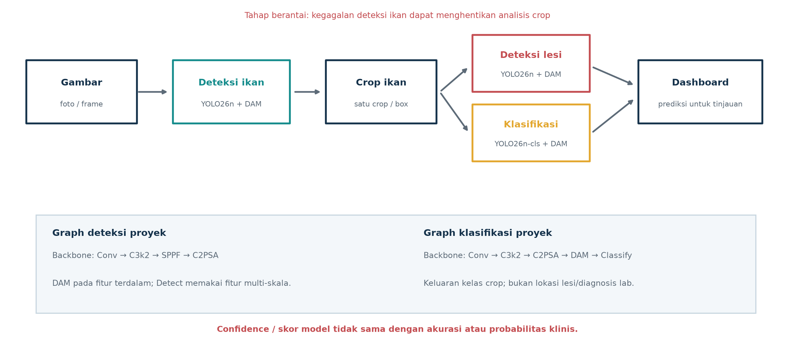
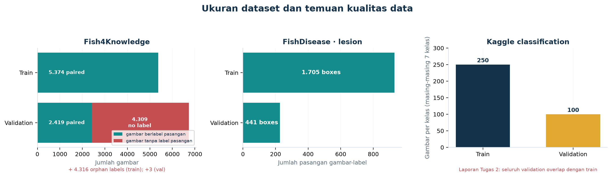
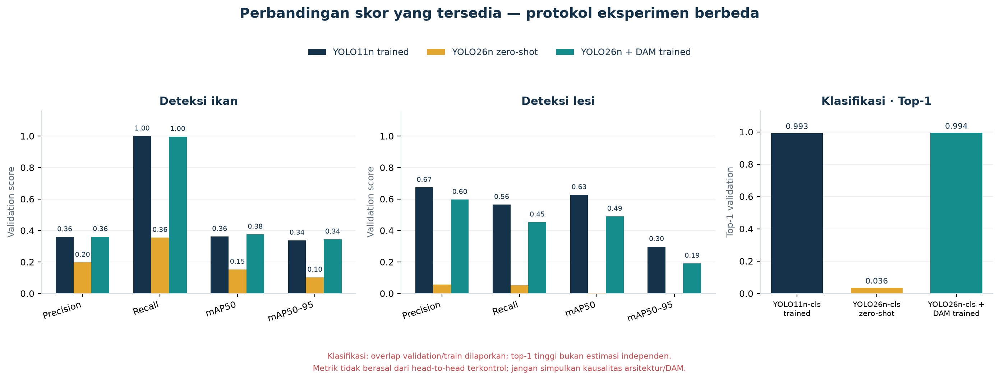
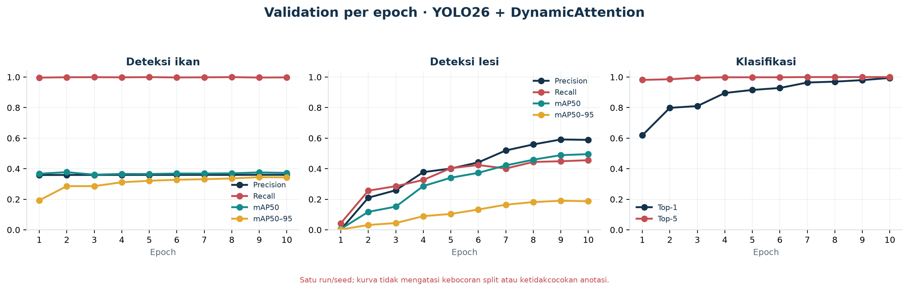
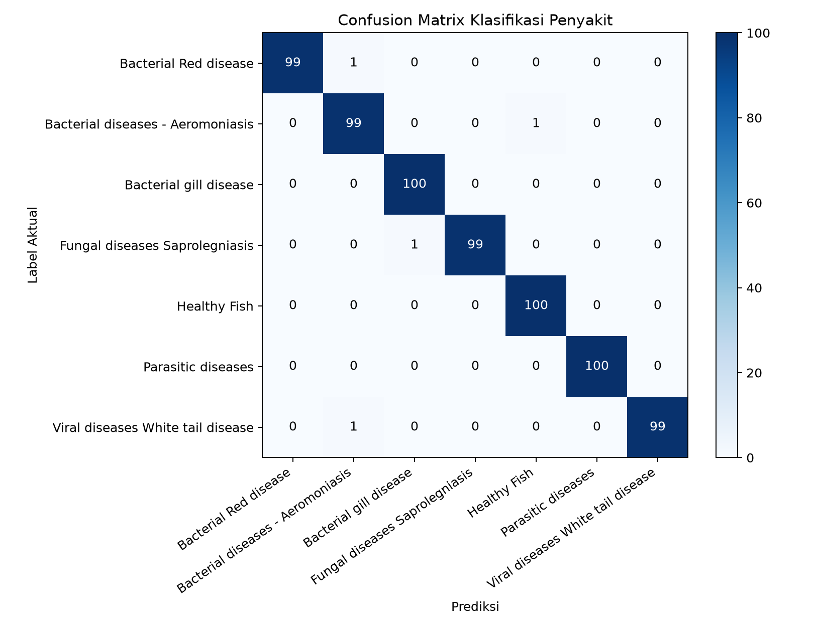

# TUGAS 4 — LAPORAN AKHIR YOLOComVis

## Evaluasi perkembangan, arsitektur, dan kelemahan model

**Kelompok 15 · Computer Vision · Kelas B**  
**Program Studi Teknik Komputer · Fakultas Ilmu Komputer · Universitas Brawijaya**  
**Jhons Janner Samuel S. (245150301111009) · Muhammad Fadly Nur Hidayat (245150300111050)**  
**Tanggal penyusunan: 28 September 2026**

## Ringkasan eksekutif

Laporan ini menyatukan tiga tahap tugas sebelumnya dan perkembangan terbaru pada repositori. Tugas 1 menyusun landasan YOLO26, Dynamic Attention, dan desain pipeline. Tugas 2 membangun baseline terlatih YOLO11n untuk deteksi ikan dan lesi serta YOLO11n-cls untuk klasifikasi. Tugas 3 mengevaluasi checkpoint YOLO26 umum tanpa fine-tuning (zero-shot) dan dengan tepat menyatakan bahwa Dynamic Attention belum diterapkan pada eksperimen tersebut. Setelah itu, kode dan artefak proyek berkembang: konfigurasi YOLO26n + DynamicAttention dipakai untuk melatih ketiga tugas selama 10 epoch, dan hasil validasinya tersimpan.

Hasil terbaru menunjukkan deteksi ikan memiliki recall sangat tinggi (**0,997**) tetapi precision rendah (**0,360**): model menemukan hampir semua objek berlabel pada split evaluasi, tetapi menghasilkan banyak prediksi yang tidak cocok dengan acuan. Deteksi lesi masih melewatkan banyak lesi (recall **0,453**; mAP50-95 **0,191**). Klasifikasi mencatat top-1 **0,994**, tetapi angka tersebut **tidak layak ditafsirkan sebagai performa pada data baru** karena laporan Tugas 2 menyatakan seluruh gambar validasi klasifikasi pada snapshot itu berulang terhadap data train.

Temuan operasional paling penting adalah ketidaklengkapan anotasi Fish4Knowledge: inventaris proyek mencatat 4.316 label tanpa pasangan gambar di train dan 4.309 gambar tanpa label pasangan di validation. Selain itu, tiga model dilatih dari tiga sumber gambar berbeda dan belum diuji sebagai sistem terpadu pada test set independen yang memiliki anotasi ikan, lesi, dan kelas kondisi sekaligus. Dashboard adalah alat demonstrasi prediksi untuk ditinjau, bukan bukti diagnosis.

**Rekomendasi akhir:** pertahankan model sebagai prototipe riset; jangan membuat klaim kesehatan atau publikasi performa final sebelum audit label, pemisahan data berbasis sumber/individu, pelatihan ulang terkontrol, dan evaluasi test independen selesai.

> **Status kesimpulan:** proyek telah mencapai proof-of-concept tiga tahap (deteksi ikan, kandidat lesi, klasifikasi citra), tetapi **belum menjadi sistem diagnosis yang tervalidasi**. Metrik klasifikasi tinggi belum dapat dianggap sebagai generalisasi karena laporan sebelumnya menemukan citra validasi berulang pada data train. Dataset deteksi ikan juga memiliki ribuan ketidakcocokan pasangan gambar-label. Dynamic Attention sudah dipakai pada checkpoint terbaru, tetapi kontribusinya belum dapat dipisahkan melalui eksperimen ablasi yang adil.

## Isi laporan

1. [Ruang lingkup dan sumber bukti](#1-ruang-lingkup-dan-sumber-bukti)
2. [Perkembangan dari tugas 1 sampai tugas 4](#2-perkembangan-dari-tugas-1-sampai-tugas-4)
3. [Arsitektur sistem dan model](#3-arsitektur-sistem-dan-model)
4. [Dataset dan audit kualitas](#4-dataset-dan-audit-kualitas)
5. [Hasil eksperimen](#5-hasil-eksperimen)
6. [Kelemahan setiap arsitektur dan model](#6-kelemahan-setiap-arsitektur-dan-model)
7. [Analisis dashboard dan contoh per gambar](#7-analisis-dashboard-dan-contoh-per-gambar)
8. [Risiko validitas dan batas klaim](#8-risiko-validitas-dan-batas-klaim)
9. [Rencana perbaikan dan kriteria rilis](#9-rencana-perbaikan-dan-kriteria-rilis)
10. [Kesimpulan](#10-kesimpulan)
11. [Daftar sumber dan artefak](#11-daftar-sumber-dan-artefak)

## 1. Ruang lingkup dan sumber bukti

Laporan menyatukan materi pada [Tugas 1](Tugas_1.pdf), [Tugas 2](Tugas%202.pdf), dan [Tugas 3](Tugas_3_Kelompok_15.pdf) dengan checkpoint, konfigurasi training, metrik, dan dashboard yang tersedia pada repositori saat laporan disusun. Angka historis YOLO11 diambil dari tabel/kurva Tugas 2. Angka zero-shot YOLO26 berasal dari `reports/yolo26_baseline_metrics.json`. Angka YOLO26 + DynamicAttention terbaru berasal dari `reports/evaluation_metrics.json`, yang menunjuk ke checkpoint `best.pt` dalam `runs/`.

Penilaian dibagi menjadi tiga tingkat bukti:

| Tingkat bukti | Makna dalam laporan ini |
|---|---|
| Hasil tercatat | Nilai yang muncul pada laporan atau artefak metrik. Nilai ini belum otomatis valid untuk generalisasi. |
| Temuan audit | Ketidakcocokan label, overlap split, perbedaan domain, atau ketidaksetaraan protokol yang dapat diperiksa dari laporan/artefak. |
| Interpretasi teknis | Penjelasan tentang kelemahan yang masuk akal berdasarkan konfigurasi dan perilaku metrik; harus diuji melalui eksperimen lanjutan. |

Laporan ini tidak menganggap kotak anotasi dataset selalu benar, tidak menganggap confidence sebagai probabilitas akurasi, dan tidak menyebut klasifikasi visual sebagai diagnosis laboratorium.

## 2. Perkembangan dari tugas 1 sampai tugas 4

| Tahap | Fokus dan pekerjaan | Hasil/status | Keterbatasan yang dibawa ke tahap berikut |
|---|---|---|---|
| **Tugas 1 — rancangan** | Studi YOLO, rancangan YOLO26 + Dynamic Attention, pilihan dataset Fish4Knowledge, FishDisease, dan Freshwater Fish Disease; desain pipeline tiga tahap. | Landasan teori dan rancangan sistem tersedia. | Rancangan attention bukan bukti bahwa modul meningkatkan hasil; dataset dan masalah label masih perlu diverifikasi. |
| **Tugas 2 — baseline YOLO11** | YOLO11n untuk deteksi ikan dan lesi, YOLO11n-cls untuk klasifikasi; training 10 epoch dan integrasi crop ke dashboard. | Baseline berjalan dan menghasilkan metrik serta artefak visual. | Laporan mencatat seluruh validation klasifikasi berulang terhadap train; label Fish4Knowledge tidak konsisten; model lesi masih melewatkan objek. |
| **Tugas 3 — perpindahan ke YOLO26** | Evaluasi checkpoint umum `yolo26n.pt` dan `yolo26n-cls.pt` pada validation lokal. | Zero-shot berhasil dijalankan; hasil rendah pada task domain-spesifik dicatat. | Ini bukan fine-tuning. Dokumen Tugas 3 dengan benar menyatakan Dynamic Attention belum ada pada run tersebut; YOLO11 terlatih vs YOLO26 zero-shot bukan perbandingan adil. |
| **Tugas 4 — keadaan repositori saat ini** | Training YOLO26n + modul DynamicAttention pada tiga task; evaluasi, dashboard validasi beracuan, dan audit alur data. | Checkpoint 10 epoch tersedia untuk ikan, lesi, dan klasifikasi; 420 dashboard beracuan telah dibuat untuk inspeksi. | Belum ada test independen; data masih bermasalah; dampak DAM belum terisolasi; pipeline lintas-domain belum divalidasi end-to-end. |

### Konfigurasi training terbaru yang teramati

Run terbaru yang menjadi sumber metrik: deteksi ikan `model_ikan-4`, deteksi lesi `model_lesi`, dan klasifikasi `model_penyakit`. `args.yaml` mencatat 10 epoch, seed 42, batch 8, input 640 untuk deteksi dan 224 untuk klasifikasi, optimizer `auto`, CUDA device 0, AMP aktif, serta `resume=False`. Checkpoint memuat graph YAML dengan DynamicAttention.

Ini menunjukkan konfigurasi eksperimen, bukan protokol final yang cukup untuk publikasi. Versi paket, pembagian berbasis grup, variasi antar-seed, durasi/latensi, dan test independen belum dibuktikan sebagai bagian dari evaluasi final.

## 3. Arsitektur sistem dan model

Pada inferensi, detektor ikan bekerja pada gambar penuh. Setiap kotak ikan dipotong, kemudian crop dikirim secara terpisah ke detektor lesi dan classifier. Detektor menghasilkan lokasi kandidat lesi; classifier menghasilkan kelas tingkat gambar tanpa lokasi. Dashboard menggabungkan keluaran tersebut. Kegagalan deteksi ikan dapat menghentikan seluruh analisis untuk ikan yang terlewat; kotak ikan yang terlalu ketat atau terlalu longgar juga mengubah input kedua model berikutnya.

| Model | Tugas dan input | Struktur yang dapat diverifikasi dari konfigurasi |
|---|---|---|
| **YOLO11n** | Deteksi ikan, gambar 640×640 | Detector satu tahap kelas `fish`; digunakan sebagai baseline terlatih Tugas 2. |
| **YOLO11n** | Deteksi lesi, gambar 640×640 | Detector satu tahap satu kelas `lesion`; digunakan sebagai baseline terlatih Tugas 2. |
| **YOLO11n-cls** | Klasifikasi 7 kelas, gambar/crop 224×224 | Head klasifikasi; digunakan sebagai baseline terlatih Tugas 2. |
| **YOLO26n** | Deteksi zero-shot pada gambar 640×640 | Checkpoint pretrained umum, tanpa pelatihan lokal pada angka Tugas 3. |
| **YOLO26n + DynamicAttention** | Deteksi ikan atau lesi, gambar 640×640 | YAML proyek memiliki backbone Conv/C3k2, SPPF, C2PSA, modul DynamicAttention pada fitur terdalam, jalur upsample/concat dan head Detect multi-skala; `end2end: True`. |
| **YOLO26n-cls + DynamicAttention** | Klasifikasi 7 kelas, gambar/crop 224×224 | Backbone Conv/C3k2 dan C2PSA, DynamicAttention di fitur terdalam, kemudian head Classify. Tidak ada head lokasi lesi pada classifier. |

### DynamicAttention yang dipakai

Implementasi proyek menggabungkan gate kanal dan gate spasial. Gate kanal memakai global average pooling lalu dua konvolusi 1×1 dan sigmoid; gate spasial memakai rata-rata dan maksimum antar-kanal, konvolusi 7×7 dan sigmoid. Fitur yang sudah digate diproyeksikan oleh konvolusi 1×1 dan ditambahkan sebagai residual ke masukan.

Modul tersebut adalah **implementasi khusus proyek yang terinspirasi mekanisme attention**, bukan klaim bahwa bloknya identik dengan semua komponen Dynamic Head dari paper. Pada graph deteksi, modul ditempatkan pada fitur backbone paling dalam. Karena itu, modul tidak secara langsung memulihkan detail resolusi tinggi yang sudah hilang di tahap downsampling.

## 4. Dataset dan audit kualitas

| Dataset | Train | Validation | Label/kelas | Catatan audit |
|---|---:|---:|---|---|
| Fish4Knowledge, deteksi ikan | 5.374 gambar; 9.690 label/objek tercatat | 6.728 gambar; 2.422 label/objek tercatat | Satu kelas `fish` | Tercatat 4.316 label tanpa gambar pasangan pada train; pada val tercatat 4.309 gambar tanpa label pasangan dan 3 label tanpa gambar. Mayoritas gambar val tidak dapat diperlakukan sebagai negatif tanpa pemeriksaan sumber/anotasi. |
| FishDisease, deteksi lesi | 929 gambar; 1.705 kotak | 226 gambar; 441 kotak | Satu kelas gabungan `lesion` | Pasangan gambar-label pada inventaris tersedia; konsistensi individu/sesi lintas split dan benar tidaknya anotasi belum diaudit ahli. |
| Freshwater Fish Disease (Kaggle), klasifikasi | 1.750 gambar (250 per kelas) | 700 gambar (100 per kelas) | 7 kelas penyakit/kondisi | Tugas 2 mencatat seluruh gambar validasi pada snapshot berulang terhadap train. Top-1 validation karenanya tidak boleh dipakai sebagai estimasi performa pada data independen sampai split dibangun ulang dan overlap diperiksa. |

Hitungan di atas adalah snapshot artefak laporan, bukan inventaris ulang seluruh arsip mentah pada tanggal ini. Pada Fish4Knowledge, objek label tanpa berkas gambar pasangan menunjukkan bahwa proses konversi mask, indeks nama gambar, atau struktur output perlu diperiksa. Citra tanpa label juga ambigu: bisa merupakan latar tanpa ikan, bisa pula objek ikan yang kehilangan anotasi. Memperlakukan semua citra itu sebagai negative background dapat menurunkan validitas training dan evaluasi.

| Kelas klasifikasi | Train | Validation |
|---|---:|---:|
| Bacterial diseases – Aeromoniasis | 250 | 100 |
| Bacterial gill disease | 250 | 100 |
| Bacterial Red disease | 250 | 100 |
| Fungal diseases Saprolegniasis | 250 | 100 |
| Healthy Fish | 250 | 100 |
| Parasitic diseases | 250 | 100 |
| Viral diseases White tail disease | 250 | 100 |

Untuk klasifikasi, pembagian dengan split acak per berkas tidak cukup bila foto merupakan crop, duplikat, burst, atau turunan dari sumber yang sama. Seluruh file val yang berulang di train adalah kebocoran langsung sebagaimana dicatat Tugas 2. Akurasi nyaris 100% pada split tersebut lebih konsisten dengan evaluasi yang tidak independen daripada bukti generalisasi.

## 5. Hasil eksperimen

### 5.1 Perbandingan metrik yang tersedia

Tabel membedakan model dan status training. Tanda **—** berarti angka tidak tersedia dalam sumber yang diperiksa. Metrik deteksi bukan angka yang sejenis dengan top-1 klasifikasi. Nilai dari protokol berbeda tidak boleh dipakai untuk menyimpulkan model terbaru lebih baik/buruk secara kausal.

| Task | Model / status | Precision atau Top-1 | Recall atau Top-5 | mAP50 | mAP50–95 |
|---|---|---:|---:|---:|---:|
| Deteksi ikan | YOLO11n, fine-tuned 10 epoch (Tugas 2) | 0,3592 | 0,9996 | 0,3618 | 0,3379 |
| Deteksi ikan | YOLO26n pretrained, zero-shot (Tugas 3) | 0,1971 | 0,3551 | 0,1531 | 0,1024 |
| Deteksi ikan | YOLO26n + DynamicAttention, 10 epoch (repositori terbaru) | 0,3601 | 0,9968 | 0,3757 | 0,3446 |
| Deteksi lesi | YOLO11n, fine-tuned 10 epoch (Tugas 2) | 0,6733 | 0,5646 | 0,6263 | 0,2968 |
| Deteksi lesi | YOLO26n pretrained, zero-shot (Tugas 3) | 0,0574 | 0,0522 | 0,0041 | 0,0017 |
| Deteksi lesi | YOLO26n + DynamicAttention, 10 epoch (repositori terbaru) | 0,5967 | 0,4528 | 0,4899 | 0,1913 |
| Klasifikasi | YOLO11n-cls, fine-tuned 10 epoch (Tugas 2) | 0,9929 | 1,0000 | — | — |
| Klasifikasi | YOLO26n-cls pretrained, zero-shot (Tugas 3) | 0,0357 | 0,0857 | — | — |
| Klasifikasi | YOLO26n-cls + DynamicAttention, 10 epoch (repositori terbaru) | 0,9943 | 1,0000 | — | — |

**Interpretasi yang sah:** YOLO26 pretrained zero-shot belum cocok dengan domain dataset proyek, terutama untuk lesi dan klasifikasi. Fine-tuning terbaru meningkatkan skor relatif terhadap zero-shot, tetapi baseline YOLO11 dan model terbaru tidak diuji pada protokol data yang bersih dan terkunci. Perbedaan angka antargenerasi tidak membuktikan dampak arsitektur atau DAM.

Pada deteksi ikan, recall 0,9968 disertai precision 0,3601 menunjukkan operating point yang menangkap banyak anotasi tetapi memiliki banyak prediksi positif yang tidak cocok. Pada lesi, mAP50 0,4899 turun menjadi mAP50–95 0,1913; model jauh lebih kesulitan memenuhi kriteria lokalisasi yang ketat. Recall 0,4528 berarti banyak anotasi lesi pada validation tidak terdeteksi pada protokol evaluasi tersimpan.

Untuk klasifikasi, top-1 0,9943 hanya menjelaskan kecocokan dengan label pada split lama. Karena overlap train-validation dilaporkan, nilai itu tidak menjadi estimasi generalisasi. Pada 280 sampel dashboard validation yang diperiksa, 280 prediksi cocok dengan label folder; sampel tersebut berasal dari validation yang sama dan bukan test independen, sehingga **tidak memperbaiki masalah kebocoran**.

### 5.2 Kurva training model DynamicAttention terbaru

Kurva memperlihatkan evolusi dalam run yang sama, bukan variasi antar-run. Sepuluh epoch dan satu seed tidak menunjukkan kestabilan statistik. Kurva training juga tidak dapat mengesahkan label atau menghapus overlap antar-split.

### 5.3 Zero-shot sebagai pembanding kompatibilitas

Zero-shot YOLO26 diuji pada seluruh split validation (`fraction=1.0` menurut skrip Tugas 3). Precision/mAP rendah untuk deteksi lesi dan top-1 klasifikasi 3,57% mengonfirmasi bahwa bobot pretrained umum tidak mengenali label/domain lokal secara langsung. Hasil ini berguna sebagai baseline kompatibilitas awal, bukan pembanding adil dengan model yang sudah fine-tuned.

## 6. Kelemahan setiap arsitektur dan model

### 6.1 YOLO11n — deteksi ikan

- **Recall tinggi bukan ketepatan tinggi.** Precision 0,3592 berarti prediksi ikan yang dihasilkan masih banyak yang tidak cocok dengan kotak acuan; false positive dapat memicu crop benda/latar yang salah pada dua tahap selanjutnya.
- **Anotasi sumber membatasi angka.** 4.316 label train dan 4.309 gambar val tercatat tidak berpasangan. Model dapat dihukum sebagai false positive pada gambar yang sebenarnya berobjek tetapi tidak memiliki anotasi, atau dilatih dengan pasangan yang salah.
- **Kapasitas nano terbatas.** Model kecil menguntungkan kecepatan/ukuran, namun bisa kesulitan pada ikan kecil, tumpang tindih, buram, kontras rendah, atau latar bawah air kompleks. Ini adalah risiko arsitektur yang perlu dikonfirmasi per ukuran/kelompok data.
- **Satu kelas menyederhanakan keluaran.** Model hanya menjawab lokasi objek `fish`; ia tidak membedakan spesies, individu, status kesehatan, atau apakah objek berada di luar domain.
- **Bias deteksi berantai.** Ikan yang terlewat tidak pernah dianalisis lesi/kelasnya; crop yang keliru menurunkan kualitas input berikutnya.

### 6.2 YOLO11n — deteksi lesi

- **Recall 0,5646 masih melewatkan sekitar 43,5% objek acuan pada evaluasi tercatat.** Karena lesi kecil dapat berdampak besar, false negative adalah kelemahan utama untuk penggunaan skrining.
- **Lokalisasi belum stabil pada IoU ketat.** mAP50 0,6263 versus mAP50–95 0,2968 menunjukkan kinerja memburuk saat bounding box harus lebih presisi.
- **Label satu kelas menggabungkan variasi.** Semua anotasi menjadi `lesion`; model tidak mengidentifikasi jenis lesi, penyebab, tingkat keparahan, atau status patogen.
- **Sumber dan jumlah terbatas.** 929 gambar train dan 226 validation belum mewakili variasi spesies, kamera, pose, pencahayaan, kualitas air, atau perangkat lapangan.
- **Rantai crop berpotensi mengubah skala.** Model dilatih pada gambar FishDisease utuh, sementara integrasi memanggilnya pada crop hasil deteksi ikan. Distribusi ukuran dan komposisi latar pada crop belum dibuktikan sama dengan training/evaluasi.

### 6.3 YOLO11n-cls — klasifikasi penyakit

- **Validation bocor.** Tugas 2 menyatakan gambar validasi berulang terhadap train. Top-1 99,29% tidak boleh dianggap performa pada ikan baru.
- **Label kelas visual bukan konfirmasi etiologi.** Kategori dataset seperti aeromoniasis, parasit, atau penyakit viral adalah label folder, bukan bukti pemeriksaan laboratorium pada citra pengguna. Gejala visual dapat tumpang tindih.
- **Klasifikasi tidak memberi lokasi.** Head Classify menghasilkan label tingkat crop/gambar, bukan kotak penyakit atau lesi. Probabilitas softmax bukan probabilitas diagnosis yang terkalibrasi.
- **Sensitif terhadap crop dan latar.** Bila ikan kecil di dalam box, terpotong, atau banyak background, fitur yang dipakai dapat berbeda dari gambar training 224×224. Model juga dapat memanfaatkan latar/warna sebagai shortcut.
- **Top-5 100% tidak berarti diagnosis benar.** Top-5 hanya berarti label folder acuan berada dalam lima pilihan teratas pada split yang diuji.

### 6.4 YOLO26n pretrained — zero-shot

- **Belum di-fine-tune pada task lokal.** Skor rendah adalah konsekuensi yang wajar ketika label umum checkpoint tidak sama dengan kelas tunggal `fish`/`lesion` atau tujuh kategori proyek.
- **Bukan model final yang dapat disamakan dengan YOLO11 terlatih.** Selisih skor terutama mencampur efek training/domain dengan efek arsitektur; tidak mengisolasi kualitas YOLO26.
- **Perannya hanya baseline kompatibilitas.** Zero-shot menunjukkan pipeline evaluasi bisa berjalan dan memberi angka acuan awal, bukan hasil deployment.

### 6.5 YOLO26n + DynamicAttention — deteksi ikan

- **Precision 0,3601 tetap rendah**, sedangkan recall 0,9968 sangat tinggi. Pola ini hampir sama dengan YOLO11 baseline; tidak ada bukti praktis bahwa DAM menyelesaikan false positive.
- **Perbandingan mAP50–95 tidak terkontrol.** Nilai 0,3446 sedikit di atas 0,3379 milik YOLO11, tetapi split, code graph, run, dan asal data tidak dikunci sebagai eksperimen head-to-head. Selisih kecil ini tidak dapat diklaim sebagai peningkatan karena DAM.
- **Attention berada di fitur terdalam.** Fitur terdalam memiliki konteks semantik tetapi resolusi spasial rendah. Sinyal ikan kecil/tepi halus mungkin sudah hilang sebelum attention bekerja.
- **Modul menambah parameter dan operasi.** Gate kanal, gate spasial, dan konvolusi proyeksi menambah komputasi/memori. Latensi dan ukuran model belum dilaporkan, sehingga trade-off speed–accuracy tidak diketahui.
- **Satu run/seed tidak mengukur variasi.** Performa dipengaruhi seed, split, augmentasi, dan optimizer `auto`; tidak ada interval ketidakpastian.

### 6.6 YOLO26n + DynamicAttention — deteksi lesi

- **Model akhir terukur masih lemah untuk menyingkirkan lesi:** recall 0,4528 dan mAP50–95 0,1913. Tidak ditemukannya kotak tidak dapat dipakai untuk menyatakan ikan bebas luka.
- **Precision 0,5967 masih menyisakan kandidat keliru.** Setiap kotak perlu diverifikasi; jumlah kotak bukan jumlah lesi yang pasti.
- **Dibanding baseline YOLO11 tercatat lebih rendah pada semua metrik deteksi**, tetapi protokol tidak cukup terkontrol untuk menyimpulkan arsitektur YOLO26 lebih buruk. Yang dapat dinyatakan adalah checkpoint terbaru belum mencapai metrik baseline historis pada angka tersimpan.
- **Satu kelas dan satu sumber membatasi generalisasi.** Tidak ada penilaian per tipe lesi, spesies, skala lesi, atau kelompok perangkat.
- **DAM terdalam tidak spesifik untuk detail mikro.** Lesi kecil membutuhkan resolusi/label yang konsisten; attention kanal/spasial pada fitur terdalam tidak mengganti kebutuhan P2/high-resolution head, data, atau anotasi presisi.

### 6.7 YOLO26n-cls + DynamicAttention — klasifikasi penyakit

- **Top-1 99,43% tidak valid sebagai bukti generalisasi** karena masalah overlap train-validation pada snapshot klasifikasi belum diselesaikan.
- **Arsitektur klasifikasi membuang posisi.** Pooling/head klasifikasi merangkum crop menjadi kelas; ia tidak memberitahu bagian tubuh yang memicu prediksi dan tidak mendeteksi lesi.
- **Domain mismatch antara dataset dan pipeline.** Training klasifikasi memakai folder gambar Kaggle; inferensi mengklasifikasikan crop dari Fish4Knowledge/FishDisease. Kinerja lintas sumber itu belum dinilai dengan label gabungan yang sah.
- **DAM bisa menambah kapasitas tetapi juga overfit.** Dataset hanya 1.750 train images dan kemungkinan memiliki duplikasi/kemiripan; tambahan gate tidak menjamin fitur relevan. Tidak ada kontrol YOLO26-cls tanpa DAM yang dilatih dengan data/split/seed/epoch sama.
- **Output confidence belum dikalibrasi.** Nilai softmax tinggi pada data bocor dapat memberi rasa yakin palsu dan tidak boleh ditampilkan sebagai peluang klinis.

### 6.8 Kelemahan pipeline gabungan

1. **Kesalahan berantai:** ikan tidak terdeteksi → tidak ada crop → lesi dan klasifikasi tidak berjalan; crop bergeser → analisis berikutnya juga bergeser.
2. **Domain tiga arah:** sumber training detektor ikan, detektor lesi, dan classifier tidak sama; konsistensi kelas/identitas ikan antar-dataset tidak diketahui.
3. **Ambang memengaruhi jumlah hasil:** confidence deteksi dan ukuran input mengubah recall/precision. Mengubah ambang untuk demo harus disertai evaluasi ulang, bukan hanya demi dashboard tampak lebih rapi.
4. **Satu foto bukan satu kondisi klinis:** foto tidak memuat riwayat, perilaku, pemeriksaan air, atau hasil lab yang mungkin dibutuhkan untuk memastikan penyebab penyakit.
5. **Dashboard adalah visualisasi:** kotak dan ranking kelas bukan bukti model memahami penyakit, dan contoh yang berhasil dipilih tidak mewakili keseluruhan dataset.

*Gambar ini menggambarkan label folder pada validation lama. Karena overlap train-validation dilaporkan, diagonal yang dominan tidak menghapus risiko kebocoran dan tidak menjadi evaluasi eksternal.*

## 7. Analisis dashboard dan contoh per gambar

Sebanyak **420 dashboard** validasi telah dibuat di `reports/dashboard_validasi_acuan/`: 60 gambar berlabel deteksi ikan, 20 gambar ikan yang tidak memiliki pasangan label (ditandai unknown), 60 gambar berlabel deteksi lesi, dan 40 gambar per masing-masing 7 kelas klasifikasi. Ringkasan per berkas tersimpan pada `reports/dashboard_validasi_acuan/perbandingan_per_gambar.csv`.

| Sampel dashboard | Hasil perbandingan dengan label dataset | Cara menafsirkan |
|---|---|---|
| 60 gambar ikan yang memiliki label pasangan | 60 TP, 0 FP, 0 FN pada sampel yang dipilih | Sampel ini hanya subset gambar berlabel, kemungkinan tidak mewakili ribuan gambar val tanpa pasangan; jangan gunakan sebagai metrik global. |
| 20 gambar ikan tanpa label pasangan | 20/20 memiliki prediksi model | Ground truth tidak diketahui. Prediksi tersebut bukan otomatis TP atau FP. |
| 60 gambar lesi berlabel | 57 TP, 33 FP, 58 FN; pencocokan IoU ≥ 0,50 | Contoh yang memperlihatkan kotak cocok, kotak tak berpasangan, serta acuan lesi yang terlewat. Label tetap perlu audit ahli. |
| 280 gambar klasifikasi (40 per kelas) | 280 prediksi top-1 cocok dengan label folder | Berasal dari validation yang bermasalah overlap; tidak membuktikan akurasi data baru. |

Contoh dashboard: [deteksi lesi dengan satu kotak cocok, satu prediksi tambahan, dan satu acuan terlewat](../reports/dashboard_validasi_acuan/deteksi_lesi/001_page101_img18_acuan_vs_prediksi.jpg). Dashboard lain menggunakan legenda yang sama: hijau = acuan dataset, merah = prediksi, TP/FP/FN ditentukan pada IoU 0,50. Untuk setiap file, kolom `image`, `dashboard`, `ground_truth_status`, `tp_iou50`, `fp_iou50`, `fn_iou50`, dan kelas prediksi pada CSV memungkinkan hasil ditelusuri kembali.

Contoh ini sengaja dibaca sebagai **perbandingan dengan anotasi**, bukan vonis mana yang benar secara biologis. Jika kotak hijau salah atau tidak lengkap, perhitungan TP/FP/FN ikut salah.

## 8. Risiko validitas dan batas klaim

| Risiko | Dampak terhadap laporan |
|---|---|
| Overlap seluruh validation klasifikasi dengan train (dicatat Tugas 2) | Akurasi 99% tidak mewakili gambar independen; risiko memorisasi/duplikasi. |
| Ribuan pasangan Fish4Knowledge tidak cocok | Precision/recall/mAP deteksi ikan dapat bias karena objek tanpa anotasi dan label yatim. |
| Split acak per gambar, tanpa grouping ID/sesi/video | Frame/citra yang sangat mirip dapat tersebar lintas split dan membesar-besarkan hasil. |
| Validation dipakai selama pemilihan checkpoint | Metrik validation bukan estimasi test akhir; pemilihan berulang dapat overfit ke validation. |
| Data sumber berbeda antartask | Hasil pada masing-masing dataset tidak menjamin sistem berantai berhasil pada input nyata yang sama. |
| Satu seed dan 10 epoch | Tidak mengukur variasi hasil maupun cukup membuktikan konvergensi. |
| Label kelas penyakit berasal dari folder | Validitas etiologi penyakit tidak dapat dipastikan dari struktur folder saja. |
| Tidak ada evaluasi ahli independen | Kesesuaian label kotak/kategori dengan kondisi ikan sebenarnya belum terkonfirmasi. |

Oleh karena itu, kata “akurasi diagnosis”, “ikan sehat”, “ikan terkena penyakit X”, “bebas luka”, “siap digunakan peternak”, serta rekomendasi pengobatan **tidak didukung bukti yang tersedia**. Istilah yang tepat adalah “prediksi model”, “kandidat lesi”, “skor model”, dan “perlu verifikasi ahli”.

## 9. Rencana perbaikan dan kriteria rilis

### Prioritas 1 — benahi dataset dan label

1. Bangun manifest dari data mentah: path gambar, path anotasi, sumber, ID ikan/video/sesi bila ada, ukuran, kelas, jumlah box, dan hash konten.
2. Jangan pernah memasangkan anotasi ke gambar secara fallback berdasarkan “gambar pertama dalam folder”. Kasus nama/path yang tidak cocok harus masuk laporan error dan diselesaikan manual.
3. Audit gambar-mask Fish4Knowledge secara visual dan periksa seluruh label yatim/berkas tak berlabel. Bedakan negative image yang sudah diperiksa dari anotasi yang hilang.
4. Periksa duplicate/exact near-duplicate Kaggle; bagi data berdasarkan ikan/sumber/sesi sebelum train-val-test.
5. Minta penilai berpengalaman memeriksa definisi kelas dan contoh anotasi lesi/penyakit. Catat adjudikasi label yang ambigu.

### Prioritas 2 — eksperimen arsitektur yang adil

1. Bekukan manifest dan split group-aware, termasuk validation untuk tuning dan test tertutup untuk evaluasi final.
2. Latih pasangan **YOLO26n tanpa DAM** dan **YOLO26n + DAM** pada data, bobot awal, seed, augmentasi, optimizer, epoch, ukuran gambar, batch, perangkat, dan evaluasi yang sama.
3. Untuk baseline historis YOLO11, ulangi training pada split yang sama bila ingin membuat klaim komparatif antargenerasi.
4. Gunakan sedikitnya beberapa seed (misalnya 3) dan laporkan rerata serta simpangan/interval untuk hasil utama. Simpan YAML, versi paket, args, hash checkpoint, dan log lengkap.
5. Pertimbangkan eksperimen khusus lesi kecil: anotasi konsisten, evaluasi per ukuran objek, input resolusi lebih tinggi/tiling, dan fitur resolusi tinggi. Ukur biaya latensi dan memori sebelum memilih arsitektur.

### Prioritas 3 — evaluasi model dan pipeline

| Task | Metrik minimum untuk dilaporkan |
|---|---|
| Deteksi ikan/lesi | Precision, recall, AP50, AP50–95, per-class dan per-size AP, jumlah gambar/objek, IoU/ambang confidence, contoh FP/FN. |
| Klasifikasi | Confusion matrix pada test independen, top-1, macro-F1, recall/sensitivity per kelas, specificity/one-vs-rest, kalibrasi dan interval ketidakpastian. |
| Pipeline | Keberhasilan ikan→crop→lesi/kelas pada gambar yang sama berlabel; kesalahan berantai; waktu per tahap dan end-to-end pada perangkat yang ditetapkan. |
| Validasi domain | Hasil per sumber/kamera/spesies/pencahayaan/sesi dan kelompok data; performa out-of-domain; audit ahli. |

### Kriteria sebelum rilis/publikasi

- Tidak ada duplikasi train-validation-test menurut ID grup dan pemeriksaan hash/near-duplicate.
- Semua pasangan gambar-label terverifikasi; jumlah unmatched didokumentasikan dan dijelaskan.
- Model, threshold, dan split dikunci sebelum membuka test set.
- Kinerja model DAM dibanding kontrol tanpa DAM dengan protokol sepadan; kontribusi attention memiliki ablation yang nyata.
- Hasil disertai metrik per kelas, interval/variansi, visual FP/FN dan validasi ahli.
- Pernyataan produk membatasi keluaran sebagai bantuan inspeksi dan tidak menampilkan status “aman” berdasarkan hasil negatif.
- Hak penggunaan dataset, lisensi, atribusi sumber, privasi, dan persetujuan untuk publikasi gambar diperiksa.

## 10. Kesimpulan

Proyek berhasil bergerak dari kajian dan rancangan (Tugas 1), ke baseline YOLO11 terlatih dan dashboard (Tugas 2), evaluasi kompatibilitas YOLO26 zero-shot (Tugas 3), lalu fine-tuning YOLO26 + DynamicAttention pada artefak terbaru (Tugas 4). Kemajuan engineering tersebut nyata: tiga model dapat dilatih dan checkpoint/evaluasi/dashboard tersedia.

Namun, **hasil akhir belum membuktikan sistem yang akurat atau aman untuk diagnosis**. Detektor lesi terbaru masih memiliki recall 0,453; detektor ikan berprecision 0,360; klasifikasi hampir 99,4% dinilai pada split yang tercatat overlap; dan label Fish4Knowledge memiliki ribuan ketidakcocokan. Arsitektur nano, penempatan attention hanya pada fitur terdalam, klasifikasi crop, satu kelas lesion, dan inferensi berantai semuanya memiliki batas teknis yang perlu diuji pada data yang baik.

Kesimpulan yang paling kuat dan jujur adalah: **YOLOComVis saat ini merupakan prototipe visualisasi dan eksperimen yang sudah berjalan, dengan performa validation yang belum dapat dianggap generalisasi. DynamicAttention sudah terpasang dan terlatih, tetapi manfaat tambahannya belum terbukti secara kausal.** Fokus tahap lanjutan harus pada pembenahan data, pemisahan independen, audit ahli, ablation, dan evaluasi test set yang benar.

## 11. Daftar sumber dan artefak

### Laporan tugas terdahulu

1. Kelompok 15. *YOLOv26 + Dynamic Attention untuk Deteksi Ikan Bawah Air dan Klasifikasi Penyakit Ikan* (Tugas 1). [PDF](Tugas_1.pdf).
2. Kelompok 15. *YOLOv26 dan Dynamic Attention untuk Deteksi Ikan Bawah Air dan Klasifikasi Penyakit Ikan* (Tugas 2; baseline YOLO11). [PDF](Tugas%202.pdf).
3. Kelompok 15. *YOLOv26 + Dynamic Attention* (Tugas 3; evaluasi YOLO26 zero-shot dan rencana eksperimen). [PDF](Tugas_3_Kelompok_15.pdf).

### Artefak repositori yang menjadi sumber angka

- `reports/evaluation_metrics.json` — metrik checkpoint YOLO26 + DynamicAttention terbaru.
- `reports/yolo26_baseline_metrics.json` — metrik zero-shot YOLO26.
- `reports/laporan_eksperimen.md` — konfigurasi, jumlah data, dan checkpoint yang dievaluasi.
- `runs/detect/Runs_DynamicAttention/model_ikan-4/args.yaml`, `model_lesi/args.yaml`, dan `runs/classify/Runs_DynamicAttention/model_penyakit/args.yaml` — konfigurasi run.
- `runs/**/results.csv` — metrik per epoch untuk run terbaru.
- `models/yolo26n_dynamic_attention.yaml`, `models/yolo26n_cls_dynamic_attention.yaml`, dan `dynamic_attention.py` — graph serta implementasi attention proyek.
- `reports/dashboard_validasi_acuan/perbandingan_per_gambar.csv` dan folder terkait — perbandingan visual terhadap label dataset, bukan test independen.

### Rujukan teori dan dataset yang disebut pada tugas sebelumnya

- Ultralytics. Dokumentasi model YOLO11 dan YOLO26. [YOLO11](https://docs.ultralytics.com/models/yolo11/) · [YOLO26](https://docs.ultralytics.com/models/yolo26/).
- Dai, X. et al. (2021). “Dynamic Head: Unifying Object Detection Heads With Attentions.” CVPR, 7373–7382. [DOI](https://doi.org/10.1109/CVPR46437.2021.00727).
- University of Edinburgh. Fish4Knowledge Fish Recognition Ground Truth.
- Computer Vision Lab, Chonnam National University. FishDisease dataset.
- Biswas, S. *Freshwater Fish Disease Aquaculture in South Asia*. Kaggle dataset.

---

**Pernyataan penggunaan:** laporan ini mendeskripsikan bukti teknis proyek dan batasnya. Prediksi model tidak boleh diperlakukan sebagai diagnosis kesehatan ikan atau dasar tunggal keputusan budidaya/pengobatan.
